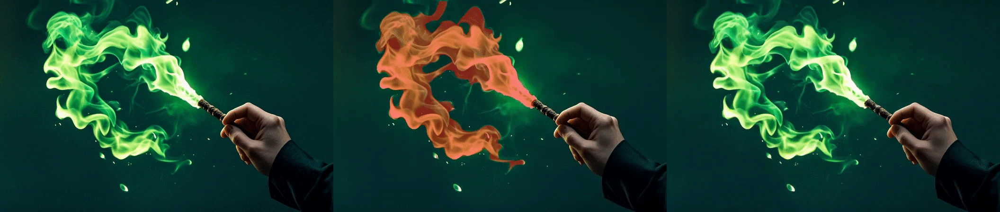

# Anonymous repository for paper submission: ICCV 2025, paper ID 592

## Dragging

- In the following samples, we **drag the movable objects (both translation/rotation; both single/multiple objects)** in the input image:

<table>
  <tr>
    <th width=34% style="text-align:center">Input Image</th>
    <th width=32% style="text-align:center">Object Dragging</th>
    <th width=34% style="text-align:center">Result</th>
  </tr>
  <tr>
    <td colspan="3"></td>
  </tr>
  <tr>
    <td colspan="3"></td>
  </tr>
  <tr>
    <td colspan="3"></td>
  </tr>
  <tr>
    <td colspan="3"></td>
  </tr>
  <tr>
    <td colspan="3"></td>
  </tr>
  <tr>
    <td colspan="3"></td>
  </tr>
  <tr>
    <td colspan="3"></td>
  </tr>
  <tr>
    <td colspan="3"></td>
  </tr>
</table>

## Camera Movement

- In the following samples, we **only move the camera** for the input sample:

<table>
  <tr>
    <th width=34% style="text-align:center">Input Image</th>
    <th width=32% style="text-align:center">Camera Movement</th>
    <th width=34% style="text-align:center">Result</th>
  </tr>
  <tr>
    <td colspan="3"></td>
  </tr>
  <tr>
    <td colspan="3"></td>
  </tr>
  <tr>
    <td colspan="3"></td>
  </tr>
  <tr>
    <td colspan="3"></td>
  </tr>
  <tr>
    <td colspan="3"></td>
  </tr>
</table>

## Camera Movement + Dragging

- In the following samples, we **move the camera and drag the movable objects** in the input image:

<table>
  <tr>
    <th width=34% style="text-align:center">Input Image</th>
    <th width=32% style="text-align:center">Camera & Object Movement</th>
    <th width=34% style="text-align:center">Result</th>
  </tr>
  <tr>
    <td colspan="3" ></td>
  </tr>
  <tr>
    <td colspan="3"></td>
  </tr>
  <tr>
    <td colspan="3"></td>
  </tr>
  <tr>
    <td colspan="3"></td>
  </tr>
  <tr>
    <td colspan="3"></td>
  </tr>
  <tr>
    <td colspan="3"></td>
  </tr>
  <tr>
    <td colspan="3"></td>
  </tr>
  <tr>
    <td colspan="3"></td>
  </tr>
  <tr>
    <td colspan="3"></td>
  </tr>
  <tr>
    <td colspan="3"></td>
  </tr>
</table>

## Motion Brush + Dragging

- In the following samples, we show the result of **combination of drag and motion brush**. The brush-unit and drag-unit are colored in red and green, respectively.

<table>
  <tr>
    <th width=25% style="text-align:center">Input Image</th>
    <th width=25% style="text-align:center">Partition</th>
    <th width=25% style="text-align:center">Dragging Signal</th>
    <th width=25% style="text-align:center">Result</th>
  </tr>
  <tr>
    <td colspan="4" ></td>
  </tr>
  <tr>
    <td colspan="4" ></td>
  </tr>
  <tr>
    <td colspan="4" ></td>
  </tr>
  <tr>
    <td colspan="4" ></td>
  </tr>
  <tr>
    <td colspan="4" ></td>
  </tr>
  <tr>
    <td colspan="4" ></td>
  </tr>
</table>

## Motion Brush for Movable Objects

In the following samples, we **brush a  mask for movable objects** in the input image and only set a scalar motion strength:

<table>
  <tr>
    <th width=34% style="text-align:center">Input Image</th>
    <th width=32% style="text-align:center">Brush Mask</th>
    <th width=34% style="text-align:center">Result</th>
  </tr>
  <tr>
    <td colspan="3" ></td>
  </tr>
  <tr>
    <td colspan="3"></td>
  </tr>
  <tr>
    <td colspan="3"></td>
  </tr>
  <tr>
    <td colspan="3"></td>
  </tr>
  <tr>
    <td colspan="3"></td>
  </tr>
  <tr>
    <td colspan="3"></td>
  </tr>
  <tr>
    <td colspan="3"></td>
  </tr>
</table>

## Motion Brush for Visual Effects

In the following samples, we **brush a  mask for fluids** in the input image and only set a scalar motion strength:

<table>
  <tr>
    <th width=34% style="text-align:center">Input Image</th>
    <th width=32% style="text-align:center">Brush Mask</th>
    <th width=34% style="text-align:center">Result</th>
  </tr>
  <tr>
    <td colspan="3"></td>
  </tr>
  <tr>
    <td colspan="3"></td>
  </tr>
  <tr>
    <td colspan="3"></td>
  </tr>
  <tr>
    <td colspan="3"></td>
  </tr>
  <tr>
    <td colspan="3"></td>
  </tr>
  <tr>
    <td colspan="3"></td>
  </tr>
  <tr>
    <td colspan="3" ></td>
  </tr>
</table>

## Comprehensive Usage for Creation

- 【Union】We use dragging, camera movement, and motion brush in one single sample. We mask the brush-unit as red and mask the drag-unit as green.

 
<table>
  <tr>
    <th width=33% style="text-align:center">Input Image & Mask</th>
    <th width=33% style="text-align:center">Controls</th>
    <th width=34% style="text-align:center">Result</th>
  </tr>
  <tr>
    <td colspan="3"></td>
  </tr>
  <tr>
    <td colspan="3"></td>
  </tr>
</table>

- 【Hitchcock】We fix the foreground and dolly out the background, creating a Hitchcock-like camera movement effect.

<table>
  <tr>
    <th width=34% style="text-align:center">Input Image</th>
    <th width=32% style="text-align:center">Controls</th>
    <th width=34% style="text-align:center">Result</th>
  </tr>
  <tr>
    <td colspan="3"></td>
  </tr>
  <tr>
    <td colspan="3"></td>
  </tr>
</table>

- 【Surrounding Character】We move the camera around a character and always keep the main character in place, which creates a beautiful dynamic portrait video.

<table>
  <tr>
    <th width=34% style="text-align:center">Input Image</th>
    <th width=32% style="text-align:center">Controls</th>
    <th width=34% style="text-align:center">Result</th>
  </tr>
  <tr>
    <td colspan="3"></td>
  </tr>
  <tr>
    <td colspan="3"></td>
  </tr>
</table>

- 【Flowing Hair】We consider the whole image as borderland, set a motion strength, and set the prompt as "flowing in the wind". Then the artistic portraits can have some dynamics.

<table>
  <tr>
    <th width=25% style="text-align:center">Input Image</th>
    <th width=25% style="text-align:center">Result</th>
    <th width=25% style="text-align:center">Input Image</th>
    <th width=25% style="text-align:center">Result</th>
  </tr>
  <tr>
    <td colspan="2"></td>
    <td colspan="2"></td>
  </tr>
  <tr>
    <td colspan="2"></td>
    <td colspan="2"></td>
  </tr>
</table>

## Demo Usage

We show several demo usage samples below, based on Gradio. When we are ready to open source the code, we will also open source the Gradio demo.

Users do not need to calculate 6-DoF parameters themselves. Instead, they only need to interact with this demo and can preview each step in real time.

Generally, user operations can be divided into two parts: unit partition and unit-wise setting.

- In the following case, we show a sample of the combination of 3 units. We choose the fire as the Unit-1 and the fox as Unit-2, leaving the background as Unit-0. The category of Unit-0/1/2 are then set as borderland/brush/drag. You can refer to the following video to see how to input parameters (including the 6-DoF parameters) to each unit.

<table>
  <tr>
    <td colspan="3"></td>
  </tr>
</table>

- In the following case, we show a sample of only camera control, where the whole image is considered as Unit-0 (the borderland unit). 

<table>
  <tr>
    <td colspan="3"></td>
  </tr>
</table>

- In the following case, we show a sample of dragging, where we choose the elephant as Unit-1 (drag-unit). 

<table>
  <tr>
    <td colspan="3"></td>
  </tr>
</table>

- In the following case, we show a sample of motion brush, where we choose the smoke as Unit-1 (brush-unit). 

<table>
  <tr>
    <td colspan="3"></td>
  </tr>
</table>

## Experiment on another base model

To prove the adaptive nature of our method, we present some results on another base model, [Seaweed](https://jimeng.jianying.com/ai-tool/image/generate).

- Camera Control:

<table>
  <tr>
    <th width=34% style="text-align:center">Generated</th>
    <th width=34% style="text-align:center">Camera Control</th>
    <th width=33% style="text-align:center">Input Image</th>
  </tr>
  <tr>
    <td colspan="3" ></td>
  </tr>
  <tr>
    <td colspan="3" ></td>
  </tr>
  <tr>
    <td colspan="3" ></td>
  </tr>
  <tr>
    <td colspan="3" ></td>
  </tr>
</table>

- Dragging:

<table>
  <tr>
    <th width=34% style="text-align:center">Generated</th>
    <th width=34% style="text-align:center">Dragging Control</th>
    <th width=33% style="text-align:center">Input Image</th>
  </tr>
  <tr>
    <td colspan="3" ></td>
  </tr>
  <tr>
    <td colspan="3" ></td>
  </tr>
  <tr>
    <td colspan="3" ></td>
  </tr>
</table>

- Motion Brush:

<table>
  <tr>
    <th width=34% style="text-align:center">Generated</th>
    <th width=34% style="text-align:center">Brush Mask</th>
    <th width=33% style="text-align:center">Input Image</th>
  </tr>
  <tr>
    <td colspan="3" ></td>
  </tr>
  <tr>
    <td colspan="3" ></td>
  </tr>
  <tr>
    <td colspan="3" ></td>
  </tr>
</table>

